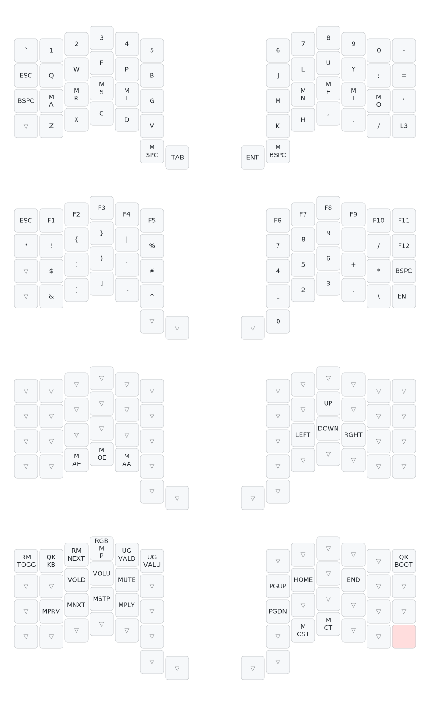
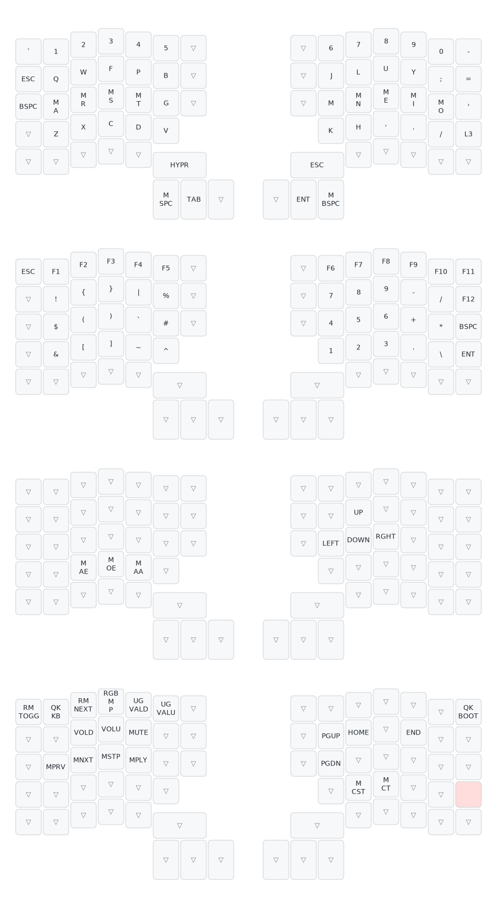

# QMK

> These are my keybinds, there are many like them but these ones are mine.

This repo contains the QMK configuration for my keyboards. Currently I'm using a

-   [ZSA Voyager](https://www.zsa.io/voyager)
-   [ZSA Moonlander](https://www.zsa.io/moonlander)

with a [Colemak mod-DH](https://colemakmods.github.io/mod-dh/) layout together with [Home Row Mods](https://precondition.github.io/home-row-mods).

## Voyager

## Moonlander

